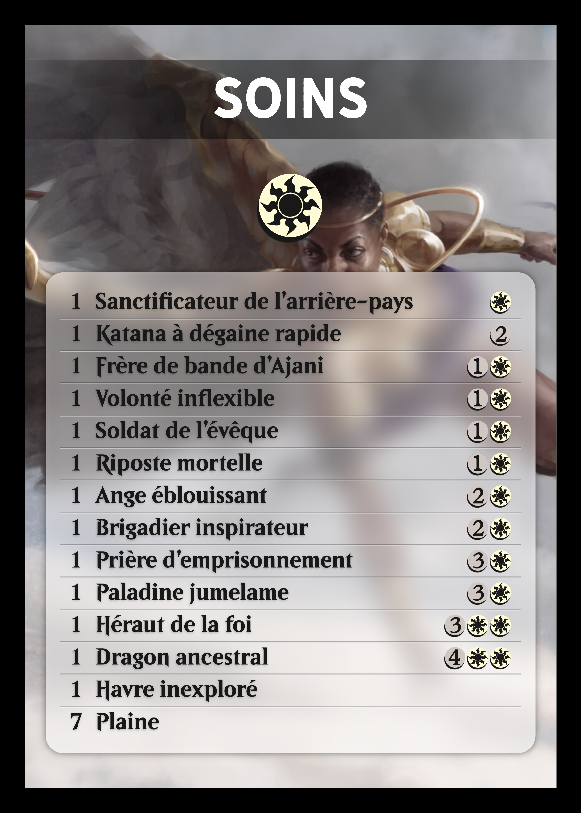

# Jumpstart decklists

I print decklists for my MTG jumpstart cube. I've overdone it.

|  |  |  |  |   |
| ----------------------------- | ----------------------------- | ----------------------------- | ----------------------------- | ------------------------------ |
|  |  |  |  |  |

## Requirements

- [Go](https://go.dev/)
- [Chrome](https://www.google.com/chrome/)

## Usage

1. Write decklists to `decks.yml`. See [Decklists](#decklists) below for more details.
2. Run `make serve` to preview decklists in your browser.
3. Run `make export` to export decklists as PNG images.

## Decklists

Decklists are written in [YAML](https://yaml.org/). For example:

```yaml
decks:
  - name: Stomp stomp
    colors: G
    art: ./grizzly_bears.png
    cards:
      - 4 Llanowar Elves G
      - 4 Grizzly Bears 1G
      - 4 Goldvein Hydra XG
      - 8 Forest -
  - name: Taste the rainbow
    colors: WUBRG
    art: ./progenitus.png
    cards:
      - 10 Progenitus WWUUBBRRGG
      - 2 Plains -
      - 2 Island -
      - 2 Swamp -
      - 2 Mountain -
      - 2 Forest -
```

### Colors & Mana costs

Colors follow the WUBRG convention:

- `W`: white
- `U`: blue
- `B`: black
- `R`: red
- `G`: green

Other mana cost symbols are also supported:

- `C`: colorless
- `S`: snow
- `0` to `9`: generic mana
- `X`: variable generic mana

You can combine multiple colors. For example, `WUB` is white, blue and black.

Mana costs are written as a sequence of colors and numbers. For example, `2W` is 2 generic mana and 1 white mana.

### Card quantities & mana costs

Each card in the decklist has three parts:

- the quantity
- the name
- the mana cost

All three parts are mandatory.

If a card has no mana cost, use `-` as the mana cost. You'll typically use this for lands.

For example:

```yaml
# A single "Llanowar Elves", which costs 1 green mana
- 1 Llanowar Elves G
# Four "Grizzly Bears", which cost 1 generic mana and 1 green mana
- 4 Grizzly Bears 1G
# Eight "Forest", which have no mana cost
- 8 Forest -
```

## Development

Run `make` or `make help` for a list of available commands.
